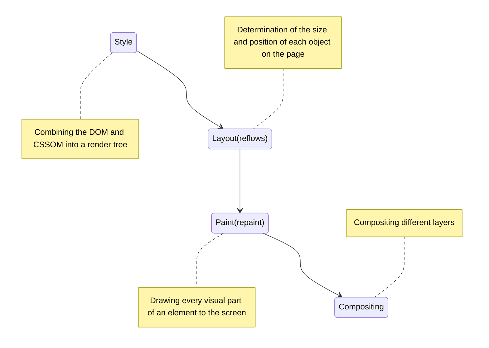

# The rendering pipeline

## Style

Each visible node has its CSSOM rules applied to it. The render tree holds all the visible nodes with content and computed styles — matching up all the relevant styles to every visible node in the DOM tree, and determining, based on the CSS cascade, what the computed styles are for each node.

## Layout

In this phase, taking the viewport size into consideration, the browser determines what the sizes of all the different boxes are going to be on the screen.

The first time the size and position of each node is determined is called layout. Subsequent recalculations of are called reflows.

## Paint

To ensure repainting can be done even faster than the initial paint, the drawing to the screen is generally broken down into several layers.

Promoting content into layers on the GPU (instead of the main thread on the CPU) improves paint and repaint performance.

Create a layer: `<video>`, `<canvas>`, `opacity`, 3D `transform`, `will-change`

## Compositing

When sections of the document are drawn in different layers, overlapping each other, compositing is necessary to ensure they are drawn to the screen in the right order and the content is rendered correctly.

**As the page continues to load assets, reflows can happen (Image that arrived late). A reflow sparks a repaint and a re-composite.**

## Note

- Avoid properties that trigger layout or paint

  Before using any CSS property for animation (other than transform and opacity), determine the property's impact on the rendering pipeline. Avoid any property that triggers layout or paint unless it's absolutely necessary.

- Force layer creation

  `will-change`
